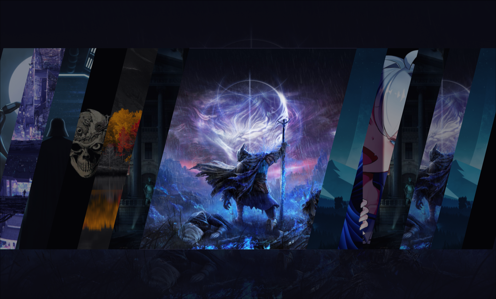

# Yet Another Wallpaper Carousel (yawc)

Pronunciation: /jˈɔːk/ (yawk)



yawc is a stylish, lightweight wallpaper selector interface for Wayland built with Quickshell and QML. It presents your wallpaper collection in an animated, slanted horizontal carousel for quick previewing and selection.

⚡ Note: This project was vibe coded.

## Features

Carousel UI: Smooth, angled horizontal card view with animated focus transitions.

Flexible Configuration: Reads YAML configuration files (config.yaml / config.yml) and supports custom file overrides using the YAWC_CONFIG environment variable.

Custom Execution: Works with any Wayland wallpaper daemon (swww, hyprpaper, mpvpaper, etc.) via customizable commands.

## Installation
```

git clone https://github.com/SirSobhan0/yawc.git
mv yawc ~/.config/quickshell/
```

## Usage

Run yawc using Quickshell:

```
qs -c yawc
```

To use a custom configuration file:

```
YAWC_CONFIG=/path/to/custom_config.yml qs -c yawc
```

## Controls

Left / Right Arrows: Scroll through wallpapers

Mouse Wheel: Scroll through wallpapers

Enter / Space / Click: Apply selected wallpaper

Escape: Exit

## Development & Maintenance Status

There will likely be no further development or active maintenance on this project. It is provided as-is for personal use. Feel free to fork and modify it for your own needs.

## License

This project is licensed under the GNU General Public License v3.0 or later (GPL-3.0-or-later). See the [COPYING](COPYING) file for full license terms.
